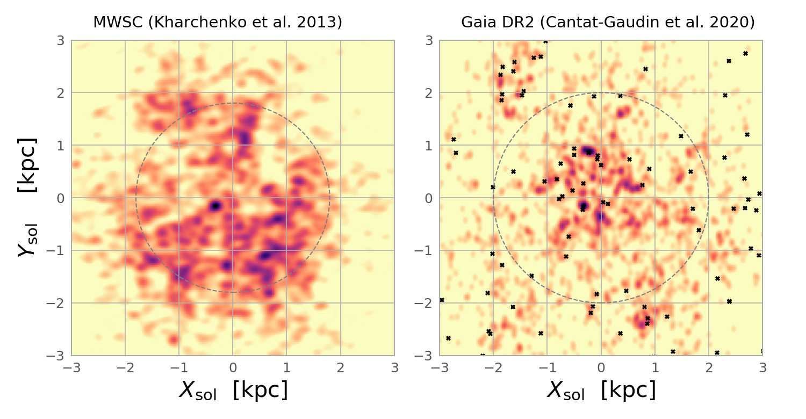
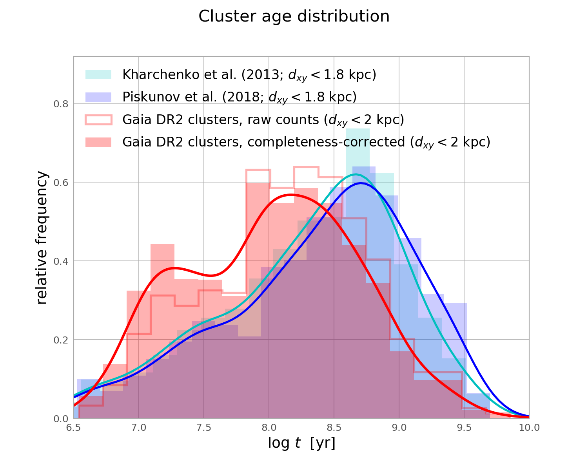

# The Milky Way's cluster age function in light of Gaia DR2

### Supplementary material for the [A&A Letter](https://ui.adsabs.harvard.edu/abs/2021A%26A...645L...2A/abstract)

This repository contains two jupyter notebooks that allow you to reproduce the figures and analysis presented in [Anders et al. 2021](https://ui.adsabs.harvard.edu/abs/2021A%26A...645L...2A/abstract:

* [gaia_dr2_cluster_age_function.ipynb](gaia_dr2_cluster_age_function.ipynb) contains the code to reproduce the figures shown in the article.
* [gaia_dr2_clusters_completeness.ipynb](https://github.com/fjaellet/gaidr2-caf/blob/master/gaia_dr2_clusters_completeness.ipynb) contains the completeness analysis we applied to correct the cluster age distribution for (age-dependent) incompleteness.

Send questions and feedback to: fanders[ät]icc.ub.edu

Latest update: 19.03.2024 corrected a minor bug in the definition of T* in the Schechter fit (see Fig. 14 in Hunt & Reffert 2024 and discussion in their text) - this only affects the value given in the Schechter fit, not the quality of the fit or the science results of the paper. Thanks to [https://github.com/emilyhunt/](Emily Hunt) for finding this!
